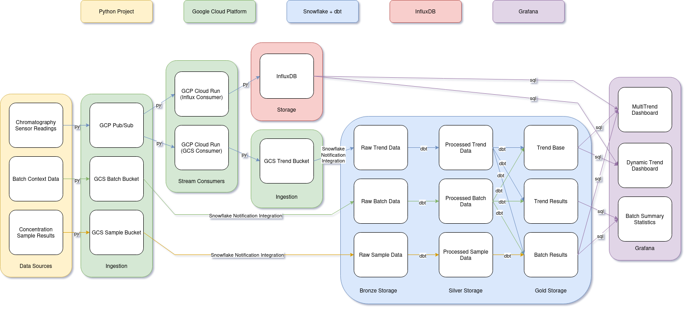
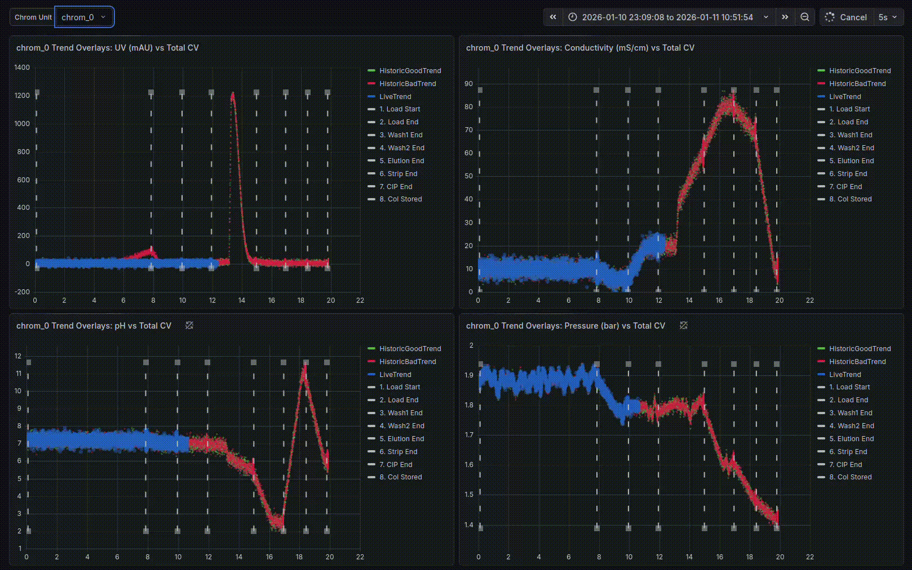

# Chromatography Streaming Project

An end-to-end data engineering project that simulates **real-time chromatography sensor data** and processes it through a modern **batch + streaming analytics platform** to enable live trend monitoring and historical batch comparison in a biopharmaceutical context.


## Project Summary

This project demonstrates how modern data engineering tools can be applied to a **real-world biopharmaceutical manufacturing use case**. It simulates chromatography operations data, processes it through streaming and batch pipelines and visualizes both **live trends** and **historical batch performance** overlaid on the same chart by column volumes.


## Background & Motivation

Chromatography operations are critical in biopharmaceutical manufacturing, and process variables such as pH, UV absorbance, pressure, and conductivity must be monitored continuously to ensure product quality and batch consistency.

In production environments, this data is:
- Generated continuously by sensors
- Required for real-time monitoring
- Used by scientists and engineers to detect process drift

This project simulates that environment using a local Python data generator and processes the data using **industry-standard cloud and analytics tooling** chosen to reflect scalable, production-ready data system design.


## Tech Stack

### Cloud & Infrastructure
- **Google Cloud Platform**: Cloud Run, Pub/Sub, Cloud Storage (GCS), Cloud Composer
- **Terraform**: Infrastructure as Code

### Data & Analytics
- **Snowflake**: Cloud data warehouse
- **dbt**: Analytics engineering and data modeling
- **InfluxDB**: Time-series database for streaming data

### Visualization
- **Grafana Cloud**

### Data Generation
- **Python**: Simulated chromatography sensors, sample results, and batch data


## Architecture Overview



### High-Level Data Flow
1. Python service simulates chromatography sensor data
2. Data is streamed via Pub/Sub and sent in batch to GCS via python
3. Cloud Run consumers write:
   - Real-time data to InfluxDB
   - Aggregated batch data to GCS
4. Snowflake ingests batch data from GCS
5. dbt transforms data through bronze → silver → gold models
6. Grafana visualizes live trends (from InfluxDB) and historical trends with contextualization (from Snowflake gold models)

## Results



The resulting dashboards enable:
- Live monitoring of chromatography trends by totalized column volumes eliminating hold periods
- Overlay of active runs against historical batches
- Early detection of process drift across key variables

Example metrics visualized:
- pH
- UV absorbance (mAU)
- Pressure (bar)
- Conductivity (mS/cm)
- Totalized column volume (batch progression)


## Setup & Reproduction Instructions

### Prerequisites
Create free or trial accounts for:
- Google Cloud Platform
- Snowflake
- InfluxDB
- Grafana Cloud


## Google Cloud Setup

### Enable Required APIs
- IAM API
- Service Management API
- Cloud Storage API
- Compute Engine API
- Artifact Registry API
- Container Registry API
- CloudBuild API
- Eventarc API
- CloudComposer API
- Cloud Pub/Sub API
- Cloud Resource Manager API
- Kubernetes Engine API

### GCP Service Account Configuration
Create a service account with the following roles:
- Storage Admin
- Service Account Admin
- Service Account User
- Pub/Sub Admin
- Project IAM Admin
- Composer Administrator
- Cloud Run Admin
- Artifact Registry Administrator

Create a key for your service account and store credentials locally:
```bash
mkdir -p .google/credentials
# move key file here and rename to gcp.json
```

### Initialize Snowflake Service Accounts:
1. Generate snowflake service account key pairs
```bash
# from project home:
mkdir -p .snowflake/credentials
cd .snowflake/credentials
```
```bash
openssl genrsa 2048 | openssl pkcs8 -topk8 -v2 aes-256-cbc -inform PEM -out snowflake_tf_key.p8
openssl rsa -in snowflake_tf_key.p8 -pubout -out snowflake_tf_key.pub
```
```bash
openssl genrsa 2048 | openssl pkcs8 -topk8 -v2 aes-256-cbc -inform PEM -out snowflake_dbt_key.p8
openssl rsa -in snowflake_dbt_key.p8 -pubout -out snowflake_dbt_key.pub
```
```bash
openssl genrsa -out snowflake_gfna_key.pem 2048
openssl rsa -in snowflake_gfna_key.pem -pubout -out snowflake_gfna_key.pub
```
2. Create terraform_srvc_account and assign public key
3. Create dbt_srvc_account and assign public key
4. Create grafana_srvc_account and assign public key

## Build resources:
1. update .env_example, rename to .env and source .env
2. apply artifactrepo terraform
```bash
# from project home
cd terraform/artifactrepo
terraform init
terraform apply
```
3. deploy gcs_consumer image
```bash
# from project home
bash gcp_cloud_run/gcs_consumer/deploy_image.sh
```
4. deploy influx_consumer image
```bash
# from project home
bash gcp_cloud_run/influx_consumer/deploy_image.sh
```
5. deploy dbt_docker image
```bash
# from project home
bash dbt/dbt_docker/deploy_image.sh
```
6. apply infra terraform
```bash
# from project home
cd terraform/infra
terraform init
terraform apply
```
7. build composer dbt secrets and deploy dags
```bash
# from project home
bash dbt/build_secrets.sh
bash dbt/deploy_dbt_dags.sh
```

### Start Data Generation:
1. Set data generation parameters if you want to change anything byt editing python_data_generation/src/config.yml
2. run src/main.py with config.yml
```bash
# from project home
cd python_data_generation
PYTHONPATH=src python src/main.py --config src/config.yml
```

### Visualize Data:
1. Data will start being streamed to InfluxDB and processed in batch from Google Cloud Storage through Snowflake tables via DBT
2. Connect to Snowflake and InfluxDB with Grafana and generate dashboards
3. The [example Grafana dashboard in Results](#results) was created using the queries in the grafana/ folder where batch_tot_cv is used for x-values and ph, uv_mau, pressure_bar, and cond_ms_cm are used for y-values.

